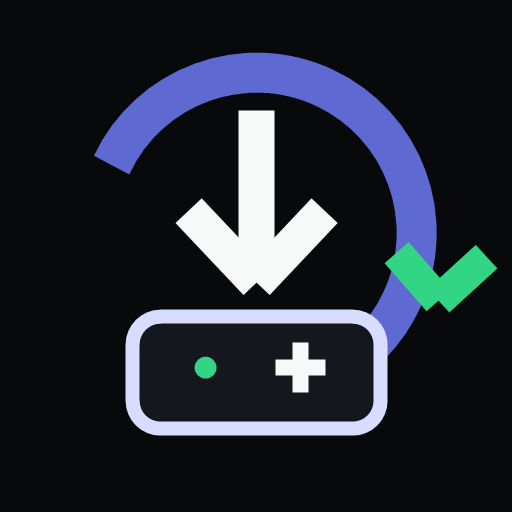
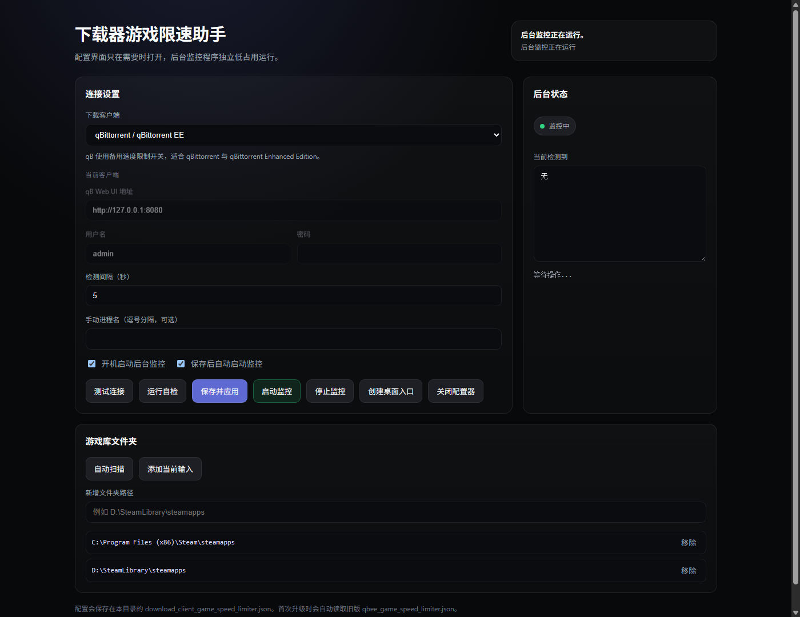

# Download Client Game Speed Limiter

[English](README.md) | [简体中文](README.zh-CN.md)



Automatically throttle torrent/magnet download clients while you play games, then restore speeds after exit. Built for Windows users who keep BT/PT downloads running in the background.

[Download for Windows](https://github.com/ZyPulse-zy/download-client-game-speed-limiter/releases/latest) · [中文教程](README.zh-CN.md) · [FAQ](README.zh-CN.md#常见问题)



## Supported Clients

| Client | Status | Game mode behavior |
| --- | --- | --- |
| qBittorrent / qBittorrent Enhanced Edition | Supported | Toggles alternative speed limits |
| Transmission | Supported | Toggles `alt-speed-enabled` through RPC |
| aria2 / Motrix | Supported | Temporarily changes global upload/download limits, then restores them |
| µTorrent / BitTorrent Classic | Supported | Temporarily changes global upload/download limits, then restores them |
| Deluge | Supported | Temporarily changes global upload/download limits, then restores them |
| BitComet | Supported through the newer WebUI | Temporarily changes global upload/download limits, then restores them |

## Why Use It?

Background BT / PT downloads can saturate your bandwidth and increase latency in CS2, Valorant, Minecraft, Palworld, voice chat, or other online games.

This tool detects when a game is running, applies a downloader-specific game-speed mode, and restores the previous state after the game exits.

## Highlights

- Supports Steam / Epic / Xbox / Battle.net / EA / Ubisoft / WeGame and common game folders.
- Supports qB, Transmission, aria2 / Motrix, µTorrent / BitTorrent Classic, Deluge, and BitComet.
- Starts the low-memory monitor with Windows.
- Keeps the configuration UI separate from the background monitor.
- Can create a desktop shortcut from the configuration UI.
- Windows executables and shortcuts use the project app icon.
- The configuration page only shows fields relevant to the selected download client.
- Includes a self-check tool for missing files, invalid URLs, game folder problems, stale monitor status, and startup settings.
- Includes portable install/uninstall scripts without requiring administrator permissions.
- Does not overwrite qB / Transmission alternative speed limits that you enabled manually.
- Restores previous global limits for aria2, µTorrent / BitTorrent, Deluge, and BitComet after the game exits.

## Download

Download `download-client-game-speed-limiter-windows.zip` from the [Releases page](https://github.com/ZyPulse-zy/download-client-game-speed-limiter/releases).

The zip contains only the end-user files:

```text
download_limiter_config.exe
download_limiter_monitor.exe
download_client_game_speed_limiter.json
install.cmd
install.ps1
uninstall.cmd
uninstall.ps1
README.zh-CN.md
LICENSE
```

Older `qbee_game_speed_limiter.json` files are imported automatically on first launch, so existing users do not need to re-enter downloader credentials.

## Quick Start

1. Enable your download client's remote control interface.
2. Extract the zip and double-click `install.cmd`, or run `download_limiter_config.exe` directly for portable use.
3. Choose qBittorrent, Transmission, aria2 / Motrix, µTorrent / BitTorrent Classic, Deluge, or BitComet in the client selector.
4. Enter the URL, username/password, or aria2 secret as needed. Deluge usually only needs the Web password.
5. Click `测试连接`.
6. Click `自动扫描` to find game library folders, or add folders manually.
7. Enable `保存后自动启动监控` and click `保存并应用`.
8. Click `运行自检` if anything looks wrong, then click `创建桌面入口` if you want a desktop shortcut.

## Notes

- qB uses its built-in alternative speed limit switch.
- Transmission uses its RPC `alt-speed-enabled` switch.
- aria2 / Motrix, µTorrent / BitTorrent Classic, Deluge, and BitComet use temporary global speed limits and restore the old values afterward.
- BitComet requires its remote access / WebUI to be enabled. BitComet 2.16 or newer is recommended.

## Build

Install Rust and MinGW-w64, then run:

```powershell
.\build.ps1
```

## License

MIT License
